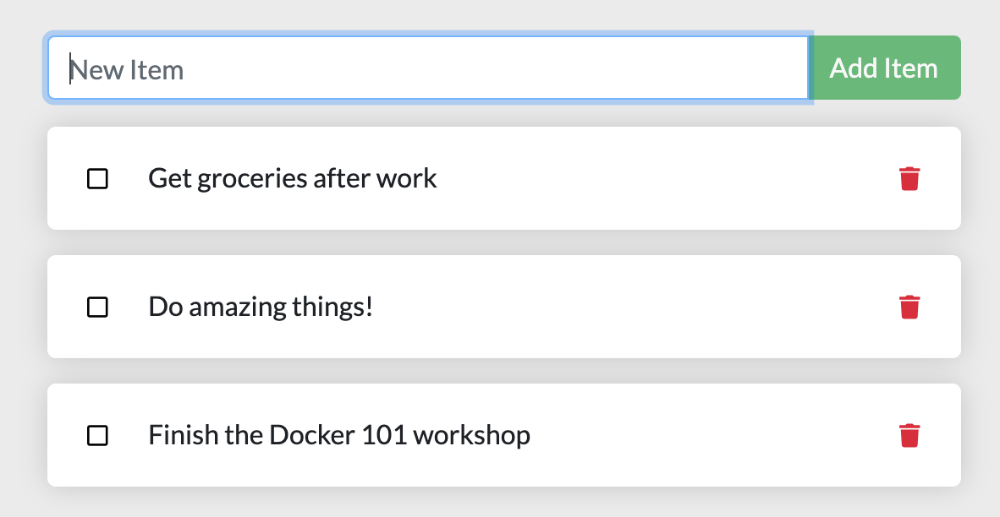

이번 강의에서 사용할 샘플 애플리케이션인 **ToDo List  Manager** 입니다.

할 일 목록(Item)을  등록하고 관리할 수 있는 간단한 Node.js 애플리케이션입니다.

​     

먼저 필요한 소스코드를 Github에서 다운로드 합니다.

 **명령어** : `git clone https://github.com/JungSangup/todo_list_manager.git app`{{exec}}

​     
> 혹시 잘 안되나요?  
> 걱정마세요. 만약을 위해서 `/root/app.zip`도 준비해뒀습니다.  
> 아래 명령어로 압축만 풀어주세요.  

 **명령어** : `unzip app.zip`{{exec}}

​     
소스코드 준비가 됐으면 app 디렉토리로 이동합니다.

 **명령어** : `cd app`{{exec}}

​     
어떤 파일들이 있는지 보려면

 **명령어** : `ls -al`{{exec}}

명령어를 실행해보세요.

---

첫 번째 실습입니다.  
그냥 일단 무작정 따라해보세요.  
자세한건 천천히 알아볼게요.  

이번 과정에서 사용할 샘플 애플리케이션인 ToDo List Manager 입니다.  
할 일 목록(Item)을 등록하고 관리할 수 있는 간단한 애플리케이션입니다.

---

먼저 필요한 소스코드를 Github에서 다운로드 합니다.  

 **명령어** : `git clone https://github.com/JungSangup/todo_list_manager.git app`{{exec}}

소스코드 준비가 됐으면 `app` 디렉토리로 이동해서 어떤 파일들이 있는지 살펴볼까요?

 **명령어** : `cd app`{{exec}}  
 **명령어** : `ls -al`{{exec}}