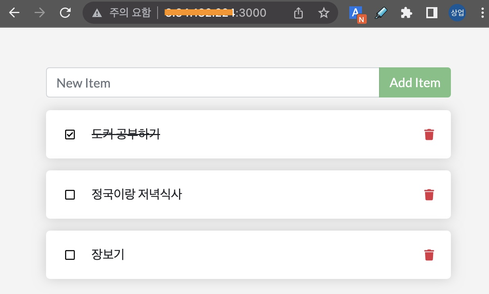

이제 샘플 애플리케이션을 실행해 보겠습니다.

앞에서는 컨테이너 이미지를 만들었습니다.  
이번에는 이 이미지를 컨테이너로 실행(run)해 보겠습니다.  
실행하는 명령어는 다음과 같습니다.  

```bash
$ docker run --detach --publish 3000:3000 docker-101
4480ffcd6fa67de20f4529cb2ccd3e0b8fba7c63fc036541c7bfd40062db2cb7
```

> 💻 `docker run --detach --publish 3000:3000 docker-101`{{exec}}

그리고, 잘 실행되고 있는지 볼까요?

```bash
$ docker ps
CONTAINER ID   IMAGE        COMMAND                  CREATED          STATUS          PORTS                                       NAMES
4480ffcd6fa6   docker-101   "docker-entrypoint.s…"   27 seconds ago   Up 26 seconds   0.0.0.0:3000->3000/tcp, :::3000->3000/tcp   youthful_noether
```

> 💻 `docker ps`{{exec}}

위 처럼 docker-101 이 보이면 정상입니다.

이제 실행된 애플리케이션에 접속해볼까요? 실행된 Host의 3000번 포트로 접속하면 됩니다.  
(Killercoda에서는 아래 링크로 제공됩니다.)  

🔗 [ToDo List Manager]({{TRAFFIC_HOST1_3000}})

---




여러분의 ToDo List Manager 애플리케이션이 잘 동작하나요?
오늘 할 일을 한 번 추가해 보세요.

축하합니다!!! (ง˙∇˙)ว

여러분은 방금 10분만에 뚝딱 시스템 환경구축을 마쳤습니다.