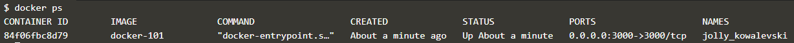

이제 샘플 애플리케이션을 실행해 보겠습니다.

​     
앞에서는 컨테이너 이미지를 만들었습니다.

이번에는 이 이미지를 실제 컨테이너로 실행(run)해 보겠습니다.

실행하는 명령어는 다음과 같습니다.

 **명령어** : `docker run --detach --publish 3000:3000 docker-101`{{exec}}

​      
잘 실행되고 있는지 볼까요?

 **명령어** : `docker ps`{{exec}}

​      
아래 그림처럼 `docker-101` 이 보이면 정상입니다.

​      
이제 아래 링크를 눌러서 우리 시스템에 접속해보세요.

 [ToDo List Manager]({{TRAFFIC_HOST1_3000}})

​     
여러분의 ToDo List Manager 애플리케이션이 잘 동작하나요?

오늘 할 일을 한 번 추가해 보세요.

​     
축하합니다!!!     (ง˙∇˙)ว

여러분은 방금 10분만에 뚝딱 시스템 구축을 마쳤습니다.
