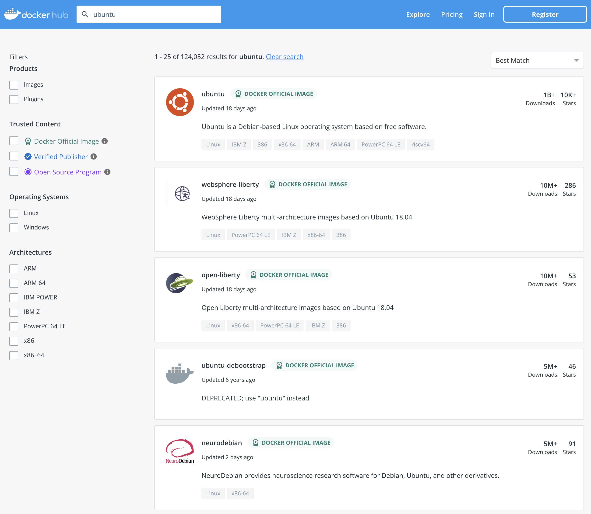

## 1. 이미지 검색하기

자주 사용되는 도커 명령어를 알아보겠습니다.

도커 이미지를 검색하는 명령어는 `docker search`입니다.
도커허브에서 Ubuntu 이미지를 찾아볼까요?  
```bash
ubuntu@ip-172-31-23-60:~$ docker search ubuntu
NAME                             DESCRIPTION                                     STARS     OFFICIAL   AUTOMATED
ubuntu                           Ubuntu is a Debian-based Linux operating sys…   15577     [OK]
websphere-liberty                WebSphere Liberty multi-architecture images …   291       [OK]
ubuntu-upstart                   DEPRECATED, as is Upstart (find other proces…   112       [OK]
neurodebian                      NeuroDebian provides neuroscience research s…   98        [OK]
ubuntu/nginx                     Nginx, a high-performance reverse proxy & we…   75
open-liberty                     Open Liberty multi-architecture images based…   56        [OK]
ubuntu/apache2                   Apache, a secure & extensible open-source HT…   53
ubuntu-debootstrap               DEPRECATED; use "ubuntu" instead                50        [OK]
ubuntu/squid                     Squid is a caching proxy for the Web. Long-t…   50
ubuntu/bind9                     BIND 9 is a very flexible, full-featured DNS…   45
ubuntu/mysql                     MySQL open source fast, stable, multi-thread…   41
ubuntu/prometheus                Prometheus is a systems and service monitori…   35
ubuntu/postgres                  PostgreSQL is an open source object-relation…   23
ubuntu/kafka                     Apache Kafka, a distributed event streaming …   22
ubuntu/redis                     Redis, an open source key-value store. Long-…   16
ubuntu/prometheus-alertmanager   Alertmanager handles client alerts from Prom…   8
ubuntu/dotnet-deps               Chiselled Ubuntu for self-contained .NET & A…   6
ubuntu/grafana                   Grafana, a feature rich metrics dashboard & …   6
ubuntu/memcached                 Memcached, in-memory keyvalue store for smal…   5
ubuntu/zookeeper                 ZooKeeper maintains configuration informatio…   5
ubuntu/dotnet-runtime            Chiselled Ubuntu runtime image for .NET apps…   5
ubuntu/telegraf                  Telegraf collects, processes, aggregates & w…   4
ubuntu/cortex                    Cortex provides storage for Prometheus. Long…   3
ubuntu/dotnet-aspnet             Chiselled Ubuntu runtime image for ASP.NET a…   3
ubuntu/cassandra                 Cassandra, an open source NoSQL distributed …   2
```

> 💻 명령어
>```bash
>docker search ubuntu
>```{{exec}}

<br><br><br>

[https://hub.docker.com/](https://hub.docker.com/) 에서도 한번 검색을 해보세요.  
두 가지 결과가 어떤지 비교도 해보시구요.
