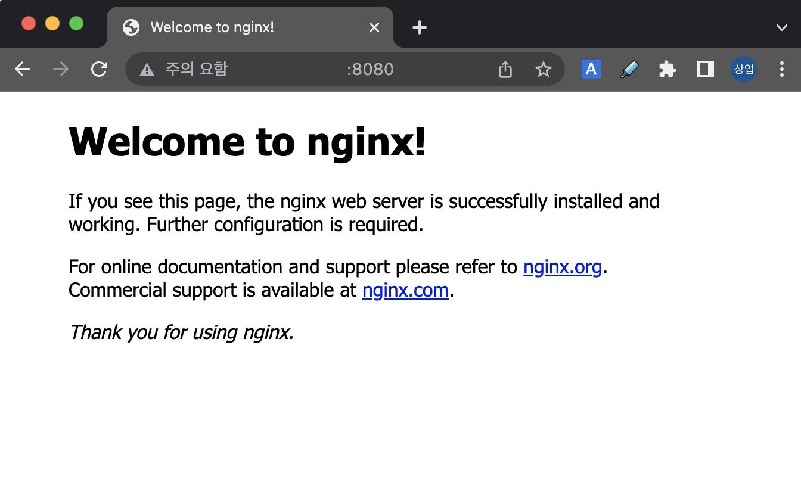

## 3. 컨테이너 실행하기

이제 실행(**run**)을 해보겠습니다.
```bash
ubuntu@ip-172-31-23-60:~/app$ docker run --interactive --tty --name my-ubuntu1 ubuntu /bin/bash
root@d68fe3ec9f65:/#
```

> 💻 명령어
>```bash
>docker run --interactive --tty --name my-ubuntu1 ubuntu /bin/bash
>```{{exec}}

`--interactive --tty` 는 `-it`로 줄여서 쓸 수도 있습니다.  
`--interactive --tty (-it)`  로 실행했기 때문에 ubuntu의 bash shell에 콘솔로 연결되었습니다. (프롬프트 확인!)

<br><br><br>

실행된 ubuntu의 OS 정보를 확인 해볼까요?
```bash
root@5229efb2bd11:/# cat /etc/os-release
PRETTY_NAME="Ubuntu 22.04.1 LTS"
NAME="Ubuntu"
VERSION_ID="22.04"
VERSION="22.04.1 LTS (Jammy Jellyfish)"
VERSION_CODENAME=jammy
ID=ubuntu
ID_LIKE=debian
HOME_URL="https://www.ubuntu.com/"
SUPPORT_URL="https://help.ubuntu.com/"
BUG_REPORT_URL="https://bugs.launchpad.net/ubuntu/"
PRIVACY_POLICY_URL="https://www.ubuntu.com/legal/terms-and-policies/privacy-policy"
UBUNTU_CODENAME=jammy
```

> 💻 명령어
>```bash
>cat /etc/os-release
>```{{exec}}

<br><br><br>

**Ubuntu 22.04 LTS**로 실행된 것을 확인할 수 있습니다. (실행한 시기에 따라 달라질 수 있습니다.)

이제 `exit` 명령어로 컨테이너를 빠져나오겠습니다.
```bash
root@5229efb2bd11:/# exit
exit
ubuntu@ip-172-31-23-60:~$
```

> 💻 명령어
>```bash
>exit
>```{{exec}}

* 참고 : `exit`는 컨테이너를 **stop**합니다. **stop**하지 않고 detach만 하기 위해서는 `ctrl-p` + `ctrl-q` 를 이용하면 됩니다.
* detach한 경우는 [docker attach](https://docs.docker.com/engine/reference/commandline/attach/) 명령어를 이용하여 다시 접속할 수 있습니다.

<br><br><br>

이번에는 `ubuntu:18.04`를 실행해봅시다.
```bash
ubuntu@ip-172-31-23-60:~/app$ docker run --interactive --tty --name my-ubuntu2 ubuntu:18.04 /bin/bash
root@cac6c7cab1f9:/#
```

> 💻 명령어
>```bash
>docker run --interactive --tty --name my-ubuntu2 ubuntu:18.04 /bin/bash
>```{{exec}}

<br><br><br>

좀전과는 다르게 `tag(18.04)`를 명시해서 실행했습니다.

`cat /etc/os-release`의 결과는 어떻게 나올까요?
```bash
root@69a29fac3bd8:/# cat /etc/os-release
NAME="Ubuntu"
VERSION="18.04.6 LTS (Bionic Beaver)"
ID=ubuntu
ID_LIKE=debian
PRETTY_NAME="Ubuntu 18.04.6 LTS"
VERSION_ID="18.04"
HOME_URL="https://www.ubuntu.com/"
SUPPORT_URL="https://help.ubuntu.com/"
BUG_REPORT_URL="https://bugs.launchpad.net/ubuntu/"
PRIVACY_POLICY_URL="https://www.ubuntu.com/legal/terms-and-policies/privacy-policy"
VERSION_CODENAME=bionic
UBUNTU_CODENAME=bionic
```

> 💻 명령어
>```bash
>cat /etc/os-release
>```{{exec}}

둘의 차이를 찾으셨나요?   ಠ_ಠ   (힌트 : VERSION)

<br><br><br>

[https://hub.docker.com/_/ubuntu](https://hub.docker.com/_/ubuntu) 를 보시면, 어떤 tag가 latest인지 알 수 있습니다.


<br>

이제 `exit` 명령어로 컨테이너에서 나와주세요.
```bash
root@69a29fac3bd8:/# exit
exit
ubuntu@ip-172-31-23-60:~$
```

> 💻 명령어
>```bash
>exit
>```{{exec}}

<br><br><br>

이번엔 다른 방법(`--detach`)으로 실행해 보겠습니다. (다른 이미지를 사용합니다.)
```bash
ubuntu@ip-172-31-23-60:~/app$ docker run --detach --name my-nginx --publish 8080:80 nginx
Unable to find image 'nginx:latest' locally
latest: Pulling from library/nginx
bb263680fed1: Pull complete
258f176fd226: Pull complete
a0bc35e70773: Pull complete
077b9569ff86: Pull complete
3082a16f3b61: Pull complete
7e9b29976cce: Pull complete
Digest: sha256:6650513efd1d27c1f8a5351cbd33edf85cc7e0d9d0fcb4ffb23d8fa89b601ba8
Status: Downloaded newer image for nginx:latest
2fc9e3a49e91f4d8ba07ea2dc80a9ee79260354d97b44486333f6661867f8c26
ubuntu@ip-172-31-23-60:~/app$
```

> 💻 명령어
>```bash
>docker run --detach --name my-nginx --publish 8080:80 nginx
>```{{exec}}

이전에 `--interactive` 옵션을 적용했을때와는 달리, 프롬프트가 그대로 있네요.

<br><br><br>

이제 `docker ps --all` 명령어로 컨테이너 목록을 조회해보세요.
```bash
ubuntu@ip-172-31-23-60:~/app$ docker ps --all
CONTAINER ID   IMAGE          COMMAND                  CREATED              STATUS                          PORTS                                   NAMES
2fc9e3a49e91   nginx          "/docker-entrypoint.…"   45 seconds ago       Up 44 seconds                   0.0.0.0:8080->80/tcp, :::8080->80/tcp   my-nginx
cac6c7cab1f9   ubuntu:18.04   "/bin/bash"              About a minute ago   Exited (0) About a minute ago                                           my-ubuntu2
d68fe3ec9f65   ubuntu         "/bin/bash"              2 minutes ago        Exited (0) About a minute ago                                           my-ubuntu1
```

> 💻 명령어
>```bash
>docker ps --all
>```{{exec}}

이전에 실행했던 ubuntu와 nginx가 보일거예요.  
ubuntu는 **Exited** 상태이고, nginx는 **Running** 상태 입니다.

<br><br><br>

nginx가 정말 Running 상태인지 8080번 포트로 접속해서 확인도 해보세요.
- AWS EC2인 경우 인스턴스의 **Public IPv4 address**로 접속하면 됩니다. (e.g. http://IP:8080/)
- Security group의 Inbound rule에 8080번 포트에 대한 규칙이 있어야 합니다.



<br><br><br>

이번엔 `docker stop` 명령어로 nginx 컨테이너를 멈춰봅시다.
```bash
ubuntu@ip-172-31-23-60:~/app$ docker stop $(docker ps --filter "name=my-nginx" --quiet)
2fc9e3a49e91
```

> 💻 명령어
>```bash
>docker stop $(docker ps --filter "name=my-nginx" --quiet)
>```{{exec}}

<br>

`docker ps --all`로 상태도 확인해보시고, 8080번 포트로 접속이 되는지 확인도 해보세요.
```bash
ubuntu@ip-172-31-23-60:~/app$ docker ps --all
CONTAINER ID   IMAGE          COMMAND                  CREATED              STATUS                          PORTS     NAMES
2fc9e3a49e91   nginx          "/docker-entrypoint.…"   About a minute ago   Exited (0) 18 seconds ago                 my-nginx
cac6c7cab1f9   ubuntu:18.04   "/bin/bash"              2 minutes ago        Exited (0) About a minute ago             my-ubuntu2
d68fe3ec9f65   ubuntu         "/bin/bash"              3 minutes ago        Exited (0) 2 minutes ago                  my-ubuntu1
```

> 💻 명령어
>```bash
>docker ps --all
>```{{exec}}
- `Exited` 상태인 컨테이너는 `--all (-a)` 옵션을 적용해야 조회가 됩니다.

 `docker start` 와 `docker restart` 는 직접 명령어를 만들어서 한번 해보세요.