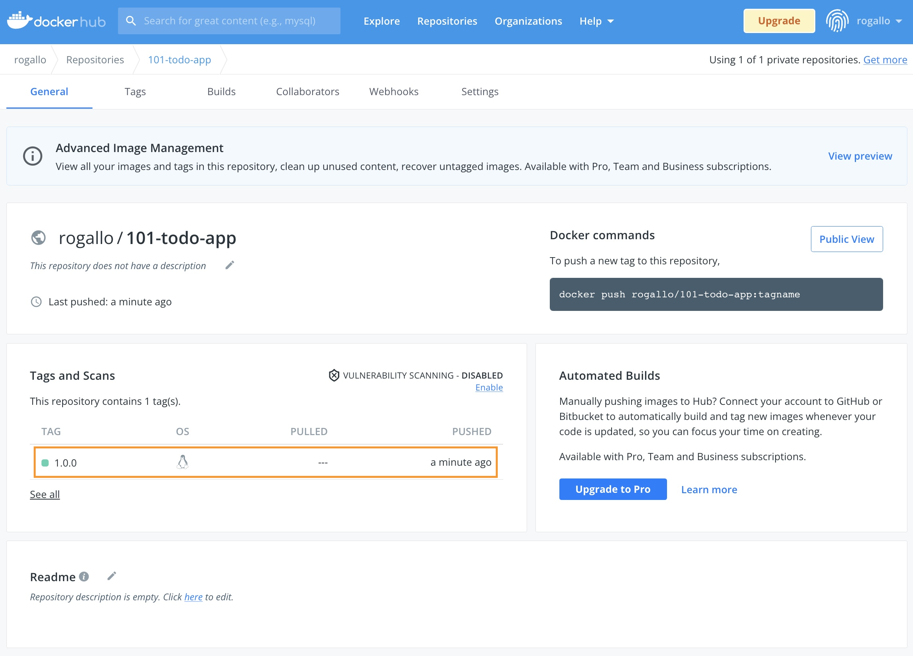

이제 도커 레지스트리에 대해 알아보고, 우리가 만든 애플리케이션을 등록해 보겠습니다.

먼저 [https://hub.docker.com/](https://hub.docker.com/) 에서 Repository를 하나 생성합니다.
로그인 후 `Create Repository` 버튼을 클릭해서 시작하면 됩니다.   
이름은 `101-todo-app` 으로 할게요.


이제 여러분의 Docker repository가 생겼습니다.  

---

샘플 애플리케이션 이미지를 다시 만들어 볼까요?
첫 번째 실습(Docker intro)을 떠올려보세요.

먼저 소스코드를 Github에서 clone 합니다.

```bash
$ git clone https://github.com/JungSangup/todo_list_manager.git app
Cloning into 'app'...
remote: Enumerating objects: 52, done.
remote: Counting objects: 100% (52/52), done.
remote: Compressing objects: 100% (49/49), done.
remote: Total 52 (delta 2), reused 52 (delta 2), pack-reused 0
Receiving objects: 100% (52/52), 1.67 MiB | 4.59 MiB/s, done.
Resolving deltas: 100% (2/2), done.
```

> **명령어** : `git clone https://github.com/JungSangup/todo_list_manager.git app`{{exec}}

그리고, 소스코드가 있는 경로로 이동해서

```bash
$ cd app
$
```

> **명령어** : `cd app`{{exec}}

---

`Dockerfile`을 이용해서 이미지를 만듭니다. (`docker build` 명령어을 이용합니다.)

```bash
$ docker build --tag docker-101 .
Sending build context to Docker daemon  6.474MB
Step 1/5 : FROM node:10-alpine
10-alpine: Pulling from library/node
ddad3d7c1e96: Pull complete
de915e575d22: Pull complete
7150aa69525b: Pull complete
d7aa47be044e: Pull complete
Digest: sha256:dc98dac24efd4254f75976c40bce46944697a110d06ce7fa47e7268470cf2e28
Status: Downloaded newer image for node:10-alpine
 ---> aa67ba258e18
Step 2/5 : WORKDIR /app
 ---> Running in ba1fc555a405
Removing intermediate container ba1fc555a405
 ---> e264c24f5921
Step 3/5 : COPY . .
 ---> 035ecc324928
Step 4/5 : RUN yarn install --production
 ---> Running in e404f12cb8f4
yarn install v1.22.5
[1/4] Resolving packages...
[2/4] Fetching packages...
info fsevents@1.2.9: The platform "linux" is incompatible with this module.
info "fsevents@1.2.9" is an optional dependency and failed compatibility check. Excluding it from installation.
[3/4] Linking dependencies...
[4/4] Building fresh packages...
Done in 10.35s.
Removing intermediate container e404f12cb8f4
 ---> 463b7f0fb593
Step 5/5 : CMD ["node", "/app/src/index.js"]
 ---> Running in 74b0d190ca4a
Removing intermediate container 74b0d190ca4a
 ---> 096cfe46290d
Successfully built 096cfe46290d
Successfully tagged docker-101:latest
```

> **명령어** : `docker build --tag docker-101 .`{{exec}}

그리고, 마지막으로 만들어진 이미지를 확인합니다.
잘 만들어져 있나요?

```bash
$ docker images docker-101
REPOSITORY   TAG       IMAGE ID       CREATED          SIZE
docker-101   latest    096cfe46290d   26 seconds ago   172MB
```

> **명령어** : `docker images docker-101`{{exec}}

---

이제 우리가 만든 이미지를 우리의 Docker hub repository에 업로드(push)해 보겠습니다.

여러분의 Repository 를 보면 push 명령어가 표시되어 있습니다. (e.g. `docker push rogallo/101-todo-app:tagname`)


그대로 실행하면 안될거예요.
아직은 우리의 Host 머신에 우리 repository를 위한 이미지가 없기 때문입니다.

---

아래 명령어로 필요한 이미지를 만들어 줍니다.  
현재 있는 이미지를 이용해서 도커 허브에 올리기 위한 새로운 이미지를 만들어 줍니다. (REPOSITORY와 TAG 정보를 변경해서)

```bash
$ docker tag docker-101 rogallo/101-todo-app:1.0.0
```

> **명령어** : `docker tag docker-101 [USER-NAME]/101-todo-app:1.0.0`{{copy}}
> [USER-NAME] 에는 여러분의 정보로 채워넣어 주세요.

이제 다시 로컬 registry의 image를 조회해보면,  

```bash
$ docker images
REPOSITORY             TAG         IMAGE ID       CREATED          SIZE
docker-101             latest      096cfe46290d   59 minutes ago   172MB
rogallo/101-todo-app   1.0.0       096cfe46290d   59 minutes ago   172MB
```

> **명령어** : `docker images`{{exec}}

이제 준비가 됐습니다.

---

먼저 로그인을 하구요,

```bash
$ docker login -u rogallo
Password:
WARNING! Your password will be stored unencrypted in /home/ubuntu/.docker/config.json.
Configure a credential helper to remove this warning. See
https://docs.docker.com/engine/reference/commandline/login/#credentials-store

Login Succeeded
```

> **명령어** : `docker login -u [USER-NAME]`{{copy}}
> [USER-NAME] 에는 여러분의 정보로 채워넣어 주세요.

아래 명령어로 docker hub의 우리 repository에 업로드(`push`) 해볼까요?

```bash
$ docker push rogallo/101-todo-app:1.0.0
The push refers to repository [docker.io/rogallo/101-todo-app]
1b433114c90c: Pushed
53f2ecccc84e: Pushed
8b231c66a1d7: Pushed
edff9ff691d5: Mounted from library/node
cbe4b9146f86: Mounted from library/node
a6524c5b12a6: Mounted from library/node
9a5d14f9f550: Mounted from library/node
1.0.0: digest: sha256:18e19953a27c5575840214c7a8d0a3acbcd78bf695d7c8884f4c401939de8913 size: 1787
```

> **명령어** : `docker push [USER-NAME]/101-todo-app:1.0.0`{{copy}}
> [USER-NAME] 에는 여러분의 정보로 채워넣어 주세요.

---

[https://hub.docker.com/](https://hub.docker.com/) 에 방금 push한 이미지가 잘 올라가 있나요?



축하합니다.  (๑˃̵ᴗ˂̵)و

이제 여러분이 만든 도커 이미지를 저장할 수 있는 공간이 생겼습니다.  
언제 어디서든 방금 올려두신 이미지를 이용해서 여러분의 샘플 애플리케이션을 실행해보실 수 있게 됐습니다.  

이번 실습은 여기까지 입니다.

