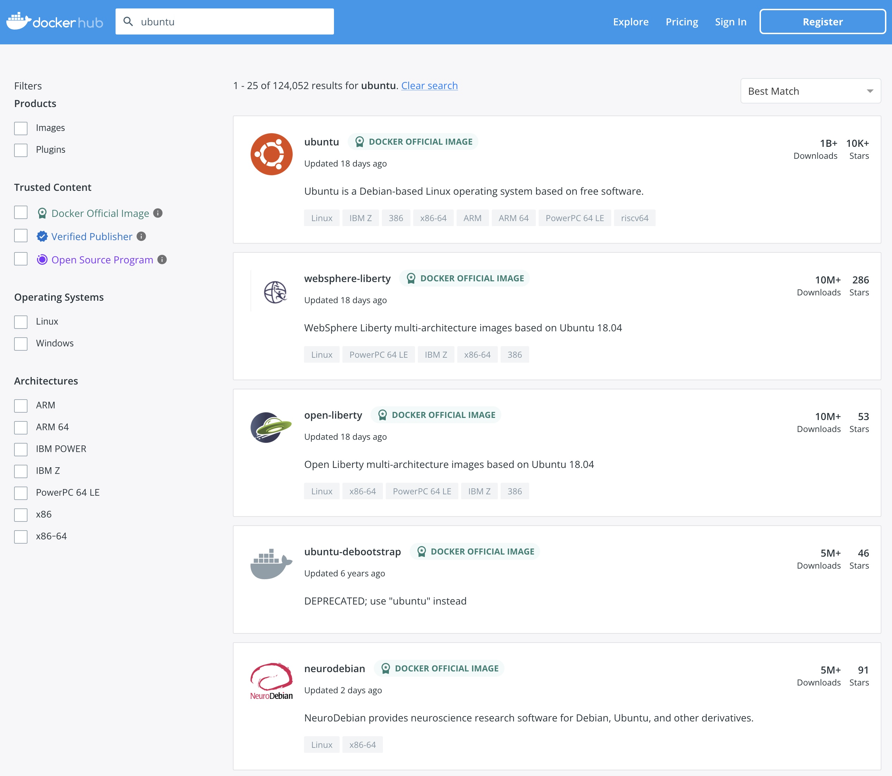

자주 사용되는 도커 명령어를 알아보겠습니다.

​
먼저 현재 컨테이너와 이미지를 모두 정리하고 시작할게요.

 **명령어** : `docker rmi --force $(docker images --all --quiet)`{{exec}}  
> --force(-f) 옵션은 강제로 삭제를 하는 옵션이니 주의해서 사용해야 합니다.

도커이미지를 검색하는 명령어는 `docker search`입니다.  
도커허브에서 Ubuntu 이미지를 찾아볼까요?   
 **명령어** : `docker search ubuntu`{{exec}}

[https://hub.docker.com/](https://hub.docker.com/) 에서도 한번 검색을 해보세요.

두 가지 결과가 어떤지 비교도 해보시구요.

---

이제 ubuntu 이미지를 다운로드(pull) 해 보겠습니다.

 **명령어** : `docker pull ubuntu`{{exec}}

tag를 특정해서(18.04) 다운로드도 해보구요.

 **명령어** : `docker pull ubuntu:18.04`{{exec}}

받아온 이미지를 확인해볼까요?   
 **명령어** : `docker images`{{exec}}

tag를 명시하지 않은 경우는 default tag인 `latest`를 받아오네요.

---

이제 실행(run)을 해보겠습니다.   
 **명령어** : `docker run --interactive --tty ubuntu /bin/bash`{{exec}}

`--interactive --tty` 로 실행했기 때문에 ubuntu의 bash shell에 콘솔로 연결되었습니다. (프롬프트 확인!)

실행된 ubuntu의 정보를 볼까요?  

 **명령어** : `cat /etc/os-release`{{exec}}

이제 `exit` 명령어로 컨테이너를 빠져나와서,
 **명령어** : `exit`{{exec}}  

`ubuntu:18.04`를 실행해봅시다.  
 **명령어** : `docker run --interactive --tty ubuntu:18.04 /bin/bash`{{exec}}

아까와는 다르게 `tag(18.04)`를 명시해서 실행했습니다.

 **명령어** : `cat /etc/os-release`{{exec}}  
의 결과는?   
둘의 차이를 찾으셨나요?   ಠ_ಠ  (힌트 : VERSION)

https://hub.docker.com/_/ubuntu?tab=description 를 보시면, 어떤 tag가 latest인지 알 수 있습니다.

이제 `exit`{{exec}} 명령어로 컨테이너에서 나와주세요.

---

이번엔 다른 방법(`--detach`)으로 실행해 보겠습니다.

 **명령어** : `docker run --detach --name my-nginx --publish 8080:80 nginx`{{exec}}

이전에 `--interactive` 옵션을 적용했을때와는 달리, 프롬프트가 그대로 있네요.

 **명령어** : `docker ps --all`{{exec}}   
명령어로 컨테이너 목록을 조회해보세요.

아까 실행했던 ubuntu와 nginx가 보일거예요.  
ubuntu는 Exited 상태이고, nginx는 Running 상태 입니다.

nginx가 정말 Running 상태인지 아래 링크를 눌러서 확인 해보세요.

 [Nginx]({{TRAFFIC_HOST1_8080}})

이번엔 nginx 컨테이너를 멈춰볼까요?  
 **명령어** : `docker stop $(docker ps --filter "name=my-nginx" --quiet)`{{exec}}  

 **명령어** : `docker ps --all`{{exec}} 
로 상태도 확인해보시고, 아래 링크를 눌러서 확인도 해보세요.

 [Nginx]({{TRAFFIC_HOST1_8080}})

 `docker start` 와 `docker restart` 는 직접 명령어를 만들어서 한번 해보세요.
> Hint : Exited 상태인 컨테이너는 --all 옵션을 적용해야 조회가 됩니다.
