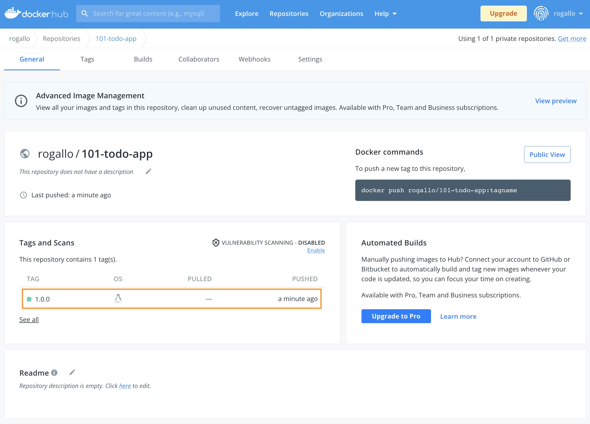

이제 도커 레지스트리에 대해 알아보고, 우리가 만든 애플리케이션을 등록해 보겠습니다.

먼저 [https://hub.docker.com/](https://hub.docker.com/) 에서 Repository를 하나 생성합니다.  
로그인 후 Create Repository 버튼을 클릭해서 시작하면 됩니다.  
이름은 `101-todo-app` 으로 할게요.

이제 여러분의 Docker repository가 생겼습니다.  
샘플 애플리케이션 이미지를 다시 만들어 볼까요?
첫 번째 실습(Docker intro)을 떠올려보세요. 

먼저 소스코드를 Github에서 clone 합니다.

`git clone https://github.com/JungSangup/todo_list_manager.git app`{{exec}}  

그리고, 소스코드가 있는 경로로 이동해서

`cd app`{{exec}}  

`Dockerfile`을 이용해서 이미지를 만듭니다. (`docker build` 명령어을 이용합니다.)

`docker build --tag docker-101 .`{{exec}}  

그리고, 마지막으로 만들어진 이미지를 확인합니다.

`docker images docker-101`{{exec}} 

이제 우리가 만든 이미지를 우리의 Docker hub repository에 업로드(push)해 보겠습니다.

여러분의 Repository 를 보면 push 명령어가 표시되어 있습니다. (e.g. `docker push rogallo/101-todo-app:tagname`)

그대로 실행하면 안될거예요.  
아직은 우리의 Host 머신에 우리 repository를 위한 이미지가 없기 때문입니다.

아래 명령어로 필요한 이미지를 만들어 줍니다. 현재 있는 이미지를 이용해서 도커 허브에 올리기 위한 새로운 이미지를 만들어 줍니다. (REPOSITORY와 TAG 정보를 변경해서)

`docker tag docker-101 [USER-NAME]/101-todo-app:1.0.0`{{copy}}
> [USER-NAME] 에는 여러분의 정보로 채워넣어 주세요. tag는 1.0.0으로 해보겠습니다.

이제 다시 로컬 registry의 image를 조회해보면,  

`docker images`{{exec}}  

이제 준비가 됐습니다.

먼저 로그인을 하구요,
`docker login -u [USER-NAME]`{{copy}}  
> [USER-NAME] 에는 여러분의 정보로 채워넣어 주세요.

아래 명령어로 docker hub의 우리 repository에 업로드(push) 해볼까요?
`docker push [USER-NAME]/101-todo-app:1.0.0`{{copy}}
> [USER-NAME] 에는 여러분의 정보로 채워넣어 주세요.

[https://hub.docker.com/](https://hub.docker.com/) 에 방금 push한 이미지가 잘 올라가 있나요?

축하합니다.  (๑˃̵ᴗ˂̵)و

이제 여러분이 만든 도커 이미지를 저장할 수 있는 공간이 생겼습니다.  
언제 어디서든 방금 올려두신 이미지를 이용해서 여러분의 샘플 애플리케이션을 실행해보실 수 있게 됐습니다.  

이번 실습은 여기까지 입니다.
