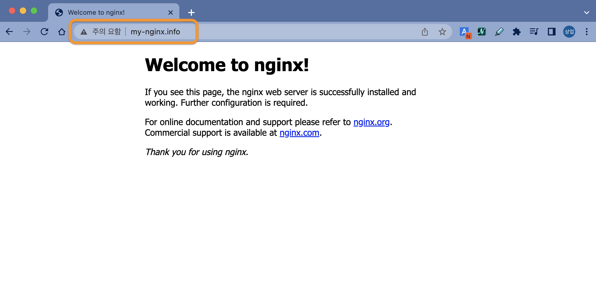

이번에는 Ingress 리소스를 생성하고 등록된 URL을 이용해서 접속해 보겠습니다.

먼저 [Nginx ingress controller](https://kubernetes.github.io/ingress-nginx/)를 설치할게요.

```bash
controlplane $ kubectl apply -f https://raw.githubusercontent.com/kubernetes/ingress-nginx/controller-v1.6.4/deploy/static/provider/cloud/deploy.yaml
namespace/ingress-nginx created
serviceaccount/ingress-nginx created
serviceaccount/ingress-nginx-admission created
role.rbac.authorization.k8s.io/ingress-nginx created
role.rbac.authorization.k8s.io/ingress-nginx-admission created
clusterrole.rbac.authorization.k8s.io/ingress-nginx created
clusterrole.rbac.authorization.k8s.io/ingress-nginx-admission created
rolebinding.rbac.authorization.k8s.io/ingress-nginx created
rolebinding.rbac.authorization.k8s.io/ingress-nginx-admission created
clusterrolebinding.rbac.authorization.k8s.io/ingress-nginx created
clusterrolebinding.rbac.authorization.k8s.io/ingress-nginx-admission created
configmap/ingress-nginx-controller created
service/ingress-nginx-controller created
service/ingress-nginx-controller-admission created
deployment.apps/ingress-nginx-controller created
job.batch/ingress-nginx-admission-create created
job.batch/ingress-nginx-admission-patch created
ingressclass.networking.k8s.io/nginx created
validatingwebhookconfiguration.admissionregistration.k8s.io/ingress-nginx-admission created
```

> 💻 명령어 `kubectl apply -f https://raw.githubusercontent.com/kubernetes/ingress-nginx/controller-v1.6.4/deploy/static/provider/cloud/deploy.yaml`{{exec}}

Nginx ingress controller는 ingress-nginx 네임스페이스에 리소스들이 생성됩니다.  
설치결과는 아래와 같이 조회 가능합니다.
```bash
controlplane $ kubectl get all -n ingress-nginx 
NAME                                           READY   STATUS      RESTARTS   AGE
pod/ingress-nginx-admission-create-vfvns       0/1     Completed   0          115s
pod/ingress-nginx-admission-patch-r8bgs        0/1     Completed   0          115s
pod/ingress-nginx-controller-c69664497-2hxlp   1/1     Running     0          115s

NAME                                         TYPE           CLUSTER-IP     EXTERNAL-IP   PORT(S)                      AGE
service/ingress-nginx-controller             LoadBalancer   10.98.196.58   <pending>     80:30076/TCP,443:31992/TCP   116s
service/ingress-nginx-controller-admission   ClusterIP      10.96.243.97   <none>        443/TCP                      116s

NAME                                       READY   UP-TO-DATE   AVAILABLE   AGE
deployment.apps/ingress-nginx-controller   1/1     1            1           116s

NAME                                                 DESIRED   CURRENT   READY   AGE
replicaset.apps/ingress-nginx-controller-c69664497   1         1         1       115s

NAME                                       COMPLETIONS   DURATION   AGE
job.batch/ingress-nginx-admission-create   1/1           12s        116s
job.batch/ingress-nginx-admission-patch    1/1           12s        115s
```

> 💻 명령어 `kubectl get all -n ingress-nginx`{{exec}}


이제 Ingress 리소스를 아래와 같이 준비합니다.  
웹 브라우저에서 http://my-nginx.info 와 같이 입력해서 접속해보려고 합니다.

```yaml
apiVersion: networking.k8s.io/v1
kind: Ingress
metadata:
  name: my-nginx-ingress
  annotations:
    nginx.ingress.kubernetes.io/rewrite-target: /$1
spec:
  rules:
    - host: my-nginx.info
      http:
        paths:
          - path: /
            pathType: Prefix
            backend:
              service:
                name: nginx-clusterip-service
                port:
                  number: 80
```
> 파일명은 **nginx-ingress.yaml**로 합니다.

<br><br><br>

이제 Ingress 리소스를 생성합니다.
```bash
ubuntu@ip-172-31-23-60:~$ kubectl apply -f nginx-ingress.yaml
ingress.networking.k8s.io/my-nginx-ingress created
```

> 💻 명령어 `kubectl apply -f nginx-ingress.yaml`{{exec}}

<br><br><br>

웹 브라우저에서 접속을 하기전에 한 가지 준비할 게 있습니다.

우리가 만든 URL은 DNS에 등록되어 있지 않기 때문에, 접속을 시도해도 어디로 라우팅 되어야하는지 알 수가 없습니다.  
간단히 우리가 접속을 하려고 하는 환경(PC)의 host파일에 다음과 같이 등록해줍니다.  
(웹 브라우저는 DNS 이전에 hosts파일을 먼저 참조합니다.)

- Windows라면 **C:\Windows\System32\drivers\etc\hosts** 파일에,
- Linux계열은 **/etc/hosts** 파일에 추가하면 됩니다.

```bash
#mspt3
11.22.33.44  my-nginx.info
```
> 11.22.33.44 대신 여러분 EC2 Instance의 **Public IPv4 address**를 써주세요.

<br><br><br>

자 이제 정말로 모두 준비가 됐습니다.
웹 브라우저에서 아래 URL로 접속해보세요.

http://my-nginx.info



잘 되네요. (ง˙∇˙)ว

**nginx-ingress.yaml** 파일의 path부분을 `/` 에서 `/test` 처럼 바꾸면 어떻게 될까요?  
한 번 해보세요.

<br>

끝~