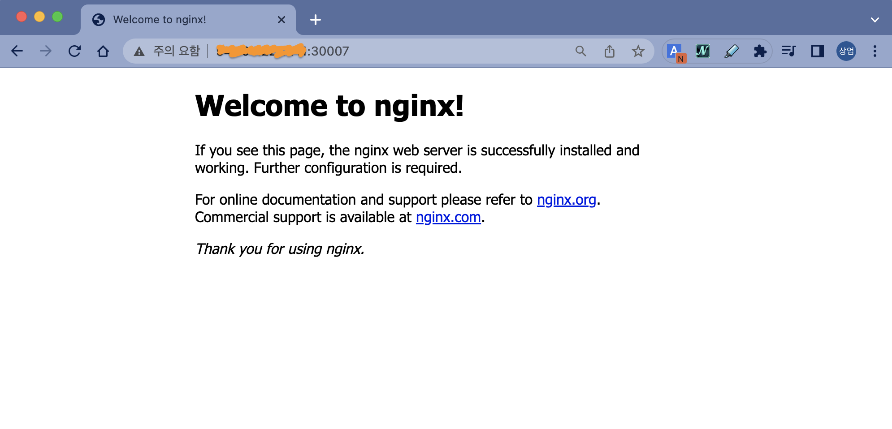

이번 실습에서는 **Service**를 이용하는 방법을 알아보겠습니다.  
먼저 **Deployment**를 이용해서 Pod를 몇 개 생성해 보겠습니다.
```yaml
apiVersion: apps/v1
kind: Deployment
metadata:
  name: my-nginx-deployment
  labels:
    app: my-nginx
    tier: frontend
spec:
  replicas: 3
  strategy:
    type: RollingUpdate
  selector:
    matchLabels:
      app: my-nginx
  template:
    metadata:
      labels:
        app: my-nginx
    spec:
      containers:
      - image: nginx:1.19.3
        name: my-nginx
        ports:
        - containerPort: 80
```
> 파일명은 **nginx-deployment.yaml**로 합니다.

<br><br><br>

그리고, 아래와 같이 생성한 다음, 생성된 Pod을 조회합니다.

```bash
ubuntu@ip-172-31-23-60:~$ kubectl apply -f nginx-deployment.yaml
deployment.apps/my-nginx-deployment created
ubuntu@ip-172-31-23-60:~$ kubectl get pods -o wide
NAME                                   READY   STATUS    RESTARTS   AGE   IP           NODE              NOMINATED NODE   READINESS GATES
my-nginx-deployment-55985c7fcf-5qlnp   1/1     Running   0          11s   172.17.0.8   ip-172-31-23-60   <none>           <none>
my-nginx-deployment-55985c7fcf-j96q4   1/1     Running   0          11s   172.17.0.3   ip-172-31-23-60   <none>           <none>
my-nginx-deployment-55985c7fcf-n6lg6   1/1     Running   0          11s   172.17.0.2   ip-172-31-23-60   <none>           <none>
```

> 💻 명령어 `kubectl apply -f nginx-deployment.yaml`{{exec}}  
> 💻 명령어 `kubectl get pods -o wide`{{exec}}

<br><br><br>

이제 위에서 생성한 Pod들을 사용하는 또다른 Pod를 하나 만들겠습니다.
```bash
ubuntu@ip-172-31-23-60:~$ kubectl run curlpod --image=radial/busyboxplus:curl --command -- /bin/sh -c "while true; do echo hi; sleep 10; done"
pod/curlpod created
```

> 💻 명령어 `kubectl run curlpod --image=radial/busyboxplus:curl --command -- /bin/sh -c "while true; do echo hi; sleep 10; done"`{{exec}}

<br><br><br>

그리고,앞에서 만들어진 Nginx Pod의 IP를 이용해서 접속해보겠습니다.
```bash
ubuntu@ip-172-31-23-60:~$ kubectl exec -it curlpod -- curl http://172.17.0.2
<!DOCTYPE html>
<html>
<head>
<title>Welcome to nginx!</title>
<style>
    body {
        width: 35em;
        margin: 0 auto;
        font-family: Tahoma, Verdana, Arial, sans-serif;
    }
</style>
</head>
<body>
<h1>Welcome to nginx!</h1>
<p>If you see this page, the nginx web server is successfully installed and
working. Further configuration is required.</p>

<p>For online documentation and support please refer to
<a href="http://nginx.org/">nginx.org</a>.<br/>
Commercial support is available at
<a href="http://nginx.com/">nginx.com</a>.</p>

<p><em>Thank you for using nginx.</em></p>
</body>
</html>
```

> 💻 명령어 `kubectl exec -it curlpod -- curl http://[POD_IP]`{{copy}}  
>[POD_IP]는 Nginx Pod 중 하나의 IP를 사용하세요.

<br><br><br>

잘 동작하네요.

하지만, 이렇게는 쓰기 어렵습니다.  
Pod의 IP가 어떻게 주어질지 우리는 알 수가 없고, Scaling되는 환경이라면 개별 Pod에 대한 Loadbalancing 문제도 있습니다.

그리고, Cluster IP는 내부에서만 사용되는 IP이기 때문에 클러스터 외부에서 접근이 필요한 경우에는 사용할 수 없습니다.

<br><br><br>

이제 **Service**를 생성해서 위의 문제들을 해결해보겠습니다.  

먼저 **ClusterIP** 타입의 서비스를 하나 만들어 보겠습니다.  
아래와 같은 파일을 준비해주세요.
```yaml
apiVersion: v1
kind: Service
metadata:
  name: nginx-clusterip-service
spec:
  type: ClusterIP
  selector:
    app: my-nginx
  ports:
    - protocol: TCP
      port: 80
      targetPort: 80
```
> 파일명은 **nginx-clusterip-service.yaml**로 합니다.

그리고, 생성합니다.

```bash
ubuntu@ip-172-31-23-60:~$ kubectl apply -f nginx-clusterip-service.yaml
service/nginx-clusterip-service created
```

> 💻 명령어 `kubectl apply -f nginx-clusterip-service.yaml`{{exec}}

<br><br><br>

생성된걸 조회할 때는 아래와 같이 합니다.
```
ubuntu@ip-172-31-23-60:~$ kubectl get services
NAME                      TYPE        CLUSTER-IP     EXTERNAL-IP   PORT(S)   AGE
kubernetes                ClusterIP   10.96.0.1      <none>        443/TCP   4d11h
nginx-clusterip-service   ClusterIP   10.99.203.15   <none>        80/TCP    25s
```

> 💻 명령어 `kubectl get services`{{exec}}

**nginx-clusterip-service** 가 우리가 조금 전 생성한 **Service** 리소스 입니다.

<br><br><br>

생성된 Service에는 **CLUSTER-IP**가 있습니다.  
이 아이피로 Pod까지 접근할 수도 있습니다.
```bash
ubuntu@ip-172-31-23-60:~$ kubectl exec -it curlpod -- curl http://10.99.203.15
<!DOCTYPE html>
<html>
<head>
<title>Welcome to nginx!</title>
<style>
    body {
        width: 35em;
        margin: 0 auto;
        font-family: Tahoma, Verdana, Arial, sans-serif;
    }
</style>
</head>
<body>
<h1>Welcome to nginx!</h1>
<p>If you see this page, the nginx web server is successfully installed and
working. Further configuration is required.</p>

<p>For online documentation and support please refer to
<a href="http://nginx.org/">nginx.org</a>.<br/>
Commercial support is available at
<a href="http://nginx.com/">nginx.com</a>.</p>

<p><em>Thank you for using nginx.</em></p>
</body>
</html>
```

> 💻 명령어 `kubectl exec -it curlpod -- curl http://[SVC_IP]`{{copy}}  
> [SVC_IP]는 Service의 CLUSTER-IP를 넣어주세요.

<br><br><br>

**IP**가 아닌 **Name**으로도 가능합니다.  
이렇게요.
```bash
ubuntu@ip-172-31-23-60:~$ kubectl exec -it curlpod -- curl nginx-clusterip-service
<!DOCTYPE html>
<html>
<head>
<title>Welcome to nginx!</title>
<style>
    body {
        width: 35em;
        margin: 0 auto;
        font-family: Tahoma, Verdana, Arial, sans-serif;
    }
</style>
</head>
<body>
<h1>Welcome to nginx!</h1>
<p>If you see this page, the nginx web server is successfully installed and
working. Further configuration is required.</p>

<p>For online documentation and support please refer to
<a href="http://nginx.org/">nginx.org</a>.<br/>
Commercial support is available at
<a href="http://nginx.com/">nginx.com</a>.</p>

<p><em>Thank you for using nginx.</em></p>
</body>
</html>
```

> 💻 명령어 `kubectl exec -it curlpod -- curl [SVC_NAME]`{{copy}}  
>또는  
> 💻 명령어 `kubectl exec -it curlpod -- curl http://[SVC_NAME]`{{copy}}  
> [SVC_NAME] 는 Service의 NAME

잘 되네요...  
이제 Service를 만들면 클러스터 내에서는 서비스의 **이름**(**NAME**)으로도 접근이 가능합니다.

<br>

K8s DNS에는 `<service-name>.<namespace-name>.svc.cluster.local`로 등록이 됩니다.  
`<service-name>`만으로 조회가 되는 이유는 [/etc/resolv.conf](https://man7.org/linux/man-pages/man5/resolv.conf.5.html)에 **search 옵션**이 자동으로 주어지기 때문입니다.  
이렇게 확인도 가능합니다.
```bash
ubuntu@ip-172-31-23-60:~$ kubectl exec -it curlpod -- cat /etc/resolv.conf
nameserver 10.96.0.10
search default.svc.cluster.local svc.cluster.local cluster.local ec2.internal
options ndots:5
```

> 💻 명령어 `kubectl exec -it curlpod -- cat /etc/resolv.conf`{{exec}}

<br><br><br>

이번엔 **NodePort**입니다.  
Node의 특정 Port를 이용하는 방식입니다.

먼저 NodePort 타입의 서비스를 하나 만들어 보겠습니다.
아래와 같은 파일을 준비해주세요.
```yaml
apiVersion: v1
kind: Service
metadata:
  name: nginx-nodeport-service
spec:
  type: NodePort
  selector:
    app: my-nginx
  ports:
    - protocol: TCP
      port: 80
      targetPort: 80
      nodePort: 30007
```
> 파일명은 **nginx-nodeport-service.yaml**로 합니다.

<br><br><br>

그리고, 생성하고 조회까지 해볼게요.
```bash
ubuntu@ip-172-31-23-60:~$ kubectl apply -f nginx-nodeport-service.yaml
service/nginx-nodeport-service created

ubuntu@ip-172-31-23-60:~$ kubectl get services
NAME                      TYPE        CLUSTER-IP      EXTERNAL-IP   PORT(S)        AGE
kubernetes                ClusterIP   10.96.0.1       <none>        443/TCP        4d11h
nginx-clusterip-service   ClusterIP   10.99.203.15    <none>        80/TCP         11m
nginx-nodeport-service    NodePort    10.102.90.119   <none>        80:30007/TCP   7s
```

> 💻 명령어 `kubectl apply -f nginx-nodeport-service.yaml`{{exec}}  
> 💻 명령어 `kubectl get services`{{exec}}

**ClusterIP**와 **NodePort** 유형의 Service간 차이가 보이시나요? (힌트 : PORT(S))

<br><br><br>

이제는 Node의 IP를 통해서 내부의 Pod로 연결이 가능합니다.  
Node까지의 경로가 열려있다면 어디서든 이 IP로 접근 가능합니다.

웹 브라우저에서 아래와 같이 조회해보세요.  
🔗 [Nginx - NodePort]({{TRAFFIC_HOST1_30007}})


